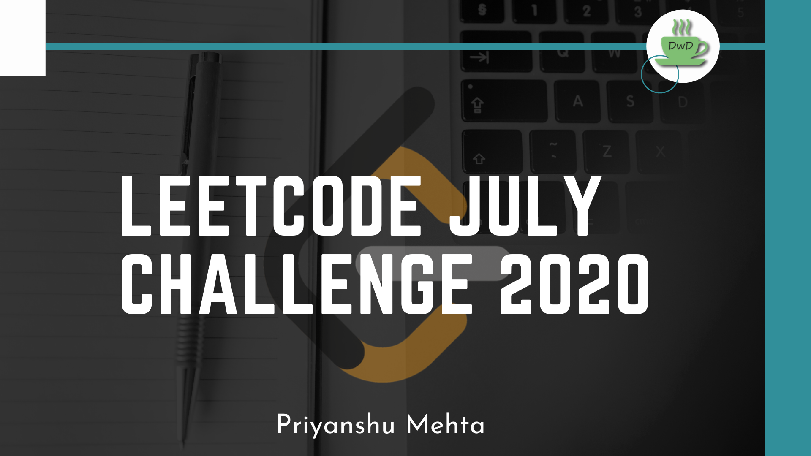

# Leetcode July Challenge 2020
Fourth month straight #oneday #onequestion #dontbreakthechain

**DAY -->  PROBLEM  -->  CONCEPT -->  DIFFICULTY   -->  LINK TO EXPLANATION**  
Day 1 --> Arranging Coins --> Binary Search & Math  --> Easy --> https://bit.ly/3giJKG6  
Day 2 --> Level Order Traversal 2 --> Binary Trees --> Easy --> https://bit.ly/2ZzAiaB  
Day 3 --> Prison Cells After N Days --> Arrays & Math --> Medium --> https://bit.ly/38nwZHg  
Day 4 --> Ugly Number 2 --> Dynamic Programming --> Medium --> https://bit.ly/2ZDfAq1  
Day 5 --> Hamming Distance --> Bit Manipulation --> Easy --> https://bit.ly/2Z2aq7S  
Day 6 --> Plus One --> Arrays & Math --> Easy --> https://bit.ly/31Odu9v  
Day 7 --> Island Perimeter --> Arrays & Geometry --> Easy --> https://bit.ly/31QKpKC  
Day 8 --> 3 Sum --> Arrays (Two Pointer) --> Medium --> https://bit.ly/3iBVghH  
Day 9 --> Max Width of Binary Tree --> Trees --> Medium --> https://bit.ly/2O9HHYD  
Day 10 --> Flatten a Multilevel Doubly Linked List --> Linked List --> Medium --> https://bit.ly/3egpWl2  
Day 11 --> Subsets --> Arrays --> Medium --> https://bit.ly/322XvVo  
Day 12 --> Reverse bits --> Bit Manipulation --> Medium (Easy on LC) --> https://bit.ly/2C2IcBq  
Day 13 --> Same Tree --> Trees --> Easy --> https://bit.ly/2WaOmWY  
Day 14 --> Angle between Hands of a cLock --> Math --> Easy (Medium on LC) --> https://bit.ly/3ft7DdX  
Day 15 --> Reverse Words in a String --> Strings --> Medium --> https://bit.ly/38YvEa6  
Day 16 --> Pow(x,n) --> Recursion & Math --> Medium --> https://bit.ly/32nURK3  
Day 17 --> Top K Frequent Elements --> Map & Bucket Sort --> Medium --> https://bit.ly/3fUq9fD  
Day 18 --> Course Schedule 2 --> Graphs (Topological Sort) --> Medium --> https://bit.ly/2DXmnE1  
Day 19 --> Add Binary --> Strings & Binary --> Easy --> To be updated  
Day 20 --> Remove Linked List Elements --> Linked List --> Easy --> To be updated  
